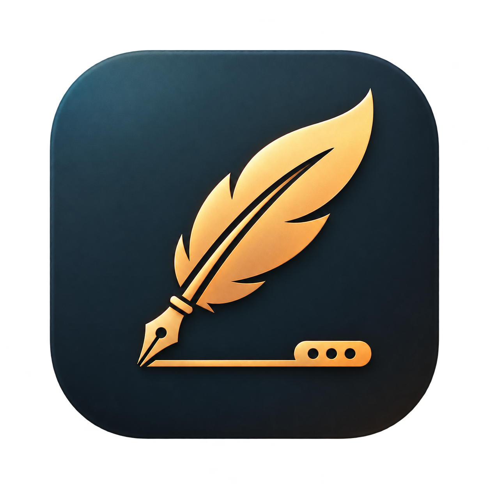

# escriba

Transcribe automaticamente las notas de voz de **Just Press Record** con
**WhisperKit** (CoreML sobre el Neural Engine, todo local). No toca la app ni
cambia como grabas: tu sigues pulsando el boton en el iPhone, el Watch o el
Mac, y el texto aparece solo.

Swift nativo. Cada transcripcion acaba en un `.txt` y en una biblioteca propia
(SQLite + copia del audio), que es la base de la app que viene.

## Por que no se leen las transcripciones de la propia app

Just Press Record no las expone. Su unica superficie programable son tres App
Intents de control — `StartRecordingIntent`, `StopRecordingIntent`,
`ToggleRecordingIntent` — sin entidades ni queries: se le puede decir que grabe,
pero no se le puede pedir nada. Tampoco tiene AppleScript (es una app Catalyst),
su URL scheme `justpressrecord://` no acepta verbos, y su extension solo recibe
audio de entrada.

Lo que si es accesible es el audio en iCloud Drive:

    ~/Library/Mobile Documents/iCloud~com~openplanetsoftware~just-press-record/Documents/
    └── YYYY-MM-DD/HH-MM-SS.m4a

Esa carpeta es la API de facto, y es sobre la que trabaja este proyecto.

## Que hace que sea fiable

Una grabacion que llega del movil no aparece como un fichero normal. Estas son
las trampas y como se manejan:

- **Placeholders de iCloud.** El fichero puede existir sin contenido, marcado
  `SF_DATALESS` en `st_flags`. Se detecta por el flag y se materializa leyendolo.
  (`brctl status` ya no sirve: devuelve `BRCloudDocsErrorDomain:30` con el
  FileProvider moderno. `NSMetadataQuery` tampoco, porque consulta el contenedor
  iCloud de la propia app y no tenemos su entitlement.)
- **Escritura progresiva.** Una grabacion en curso crece. Solo se transcribe
  cuando lleva quieta `settleSeconds` (15 s).
- **Eventos perdidos.** Si el Mac duerme o el agente esta caido cuando llega la
  grabacion, el evento FSEvents no existe al despertar. Por eso el watcher solo
  *despierta* al bucle: cada ciclo re-escanea el disco y lo compara contra el
  ledger. Es idempotente y se auto-reconcilia, ademas de barrer cada 5 minutos
  aunque no haya eventos.
- **Ritmo adaptativo.** Si algo quedo esperando a asentarse, el siguiente ciclo
  es a los 10 s, no a los 5 minutos. Sin esto una grabacion recien llegada se
  quedaba parada hasta la siguiente reconciliacion.
- **Reintentos acotados.** Un fallo se reintenta pasados 10 minutos, hasta 5 veces,
  y queda registrado con su motivo en `status`.
- **Una sola instancia a la vez.** Un `flock` sobre
  `~/.local/state/escriba/instance.lock` impide que la app y el CLI (o dos
  copias de la app) trabajen sobre el mismo ledger y transcriban por duplicado.
  El segundo en llegar se niega e identifica al que tiene el lock. `status` no
  necesita el lock: es solo lectura.
- **Una carpeta ilegible no se confunde con una carpeta vacia.** Si falla la
  lectura se reporta como error con la pista del Acceso total al disco, en vez de
  parecer que simplemente no hay nada que hacer.

### Ritmo

| Situacion | Cadencia |
|---|---|
| Aparece o cambia un `.m4a` | inmediato (FSEvents + 3 s de estabilizacion) |
| Algo esperando a asentarse o a bajar de iCloud | cada 10 s |
| Todo tranquilo | cada 5 min (barrido de seguridad) |

Latencia medida de punta a punta: **~25 s** desde que el fichero aparece hasta que
el texto esta escrito (15 de ellos son el asentamiento deliberado).

En reposo la app ocupa **~13 MB** de memoria fisica y 0 % de CPU. El modelo se
carga al llegar trabajo (la primera nota de una rafaga paga ~25 s; mientras esta
cargado la app ronda los 230 MB) y **se descarga solo tras 5 minutos sin
trabajo**, devolviendo la app al reposo.

## La app de barra de menus

`Escriba.app` es una app sin ventana ni icono en el Dock (`LSUIElement`)
que **sustituye al LaunchAgent**: ella misma es el vigilante. Desde la barra de
menus se ve el estado, las ultimas transcripciones (clic para abrirlas), el
recuento y las acciones.

Existe sobre todo porque un demonio invisible que deja de funcionar es el peor
modo de fallo posible para unas notas en las que confias. El icono cambia segun
el estado y las notificaciones avisan de cada transcripcion (sin sonido) y de
cualquier problema (con sonido).

    ./scripts/build-app.sh      # construye .build/app/Escriba.app
    ./scripts/install-app.sh    # la instala en /Applications

`install-app.sh` solo recompila la app. Si tambien quieres el CLI actualizado,
lanza `swift build -c release` aparte.

Como la firma es ad-hoc, reinstalar puede invalidar el Acceso total al disco
concedido: si tras una reinstalacion aparece "no puedo leer la carpeta",
vuelve a concederselo.

Despues:

1. **Acceso total al disco** para `Escriba` en Ajustes > Privacidad y
   seguridad, o no podra leer `~/Library/Mobile Documents`.
2. **Arranque automatico**: Ajustes > General > Elementos de inicio > +.

El registro va a `~/Library/Logs/escriba.log` ("Ver registro" en el menu).

## Uso desde terminal

El CLI sigue existiendo y comparte el mismo ledger que la app (no los ejecutes
a la vez apuntando a la misma carpeta).

    swift build -c release
    .build/release/escriba status    # que hay en disco y que se transcribio
    .build/release/escriba once      # una pasada y salir
    .build/release/escriba watch     # se queda vigilando

### Como servicio

    ./launchd/install.sh      # compila, instala en ~/.local/bin y carga el agente
    tail -f ~/Library/Logs/escriba.log
    ./launchd/uninstall.sh

> **Acceso total al disco**: launchd arranca el agente fuera de la sesion de
> Terminal, asi que hay que concederselo a `~/.local/bin/escriba` en
> Ajustes > Privacidad y seguridad. Sin eso no puede leer `~/Library/Mobile Documents`.

## El backend de transcripcion es un puerto

`Pipeline` no conoce ningun motor. Recibe un `TranscriptionBackend`, que es una
struct de funciones —`transcribe` y `preflight`— igual que `Sink`. WhisperKit es
una implementacion (`WhisperKitBackend.make(...)`), no el unico camino posible:
el mismo puerto vale para whisper.cpp en Linux o para `wasi:nn` en un runtime
WebAssembly. Nunca se lanza un proceso externo: transcribir es un puerto que
provee el host.

Cada transcripcion llega como un `Transcript` con segmentos, tiempos de inicio
y fin, tiempos por palabra y, si la diarizacion esta activa, el hablante de cada
segmento. El texto plano sigue disponible en `transcript.text`.

    escriba once --speakers    # detecta hablantes en esta pasada

## De donde sale el audio

`Pipeline` no conoce Just Press Record: recibe un `RecordingSource`, que dice
que vigilar y como enumerar lo que hay. Hay dos:

| Fuente | Que acepta | Clave |
|---|---|---|
| `jpr` (por defecto) | solo `YYYY-MM-DD/HH-MM-SS.m4a` | la del esquema |
| `folder` | cualquier audio o video, con cualquier nombre y en cualquier subcarpeta | la ruta relativa sin extension |

    escriba once --source folder --root ~/Downloads/llamadas

La salida respeta la estructura de la fuente, asi que
`soporte/llamada-42.wav` acaba en `soporte/llamada-42.txt`.

`RecordingSource` tambien declara `expectedSpeakers`, para que una carpeta que
sabes que son llamadas a dos pueda decirlo sin que nadie lo teclee grabacion a
grabacion.

**Limitacion conocida**: con grabaciones multicanal (un interlocutor por canal)
los canales se suman a mono y la diarizacion se degrada — en una prueba de 4
canales metio a los dos hablantes en el mismo. En estereo normal separa bien.

## Backends de transcripcion

| Backend | Como | Diarizacion |
|---|---|---|
| `whisperkit` (el unico hoy) | CoreML sobre el Neural Engine, sin apps de terceros | SpeakerKit (segmenter y embedder pyannote v3, clusterer v4) |

El backend MacWhisper (CLI `mw`) se retiro el 2026-09-20: era un contraste de
laboratorio y exigia lanzar procesos, que no existen en WASI.

    escriba download                      # trae el modelo (una vez)
    escriba once                          # transcribe con WhisperKit
    escriba once --speakers
    escriba once --speakers-count 2

Sin acotar, pyannote puede abrir un interlocutor de mas. Medido sobre una
llamada real de 76 s a dos voces, acierta 10 de 11 turnos y se inventa un tercer
hablante en el tramo final, donde las dos voces se solapan; con
`--speakers-count 2`, 11 de 11.

Ese tercer hablante **no se puede fusionar por parecido de voz**: sus centroides
estan a 1.021 y 1.069 de los otros dos, mas lejos de lo que estan entre si los
dos interlocutores reales (0.897). No hay umbral que lo arregle. Por eso el
pipeline **no intenta adivinar**: guarda los hablantes tal como salen y deja la
correccion para quien pueda verla. `Transcript` trae las dos operaciones que hace
falta, puras y sin I/O:

    transcript.merging(["Speaker 3"], into: "Speaker 1")
    transcript.renaming("Speaker 2", to: "Ruben")

Y `--speakers-count N` sirve para reprocesar una grabacion concreta cuando ya
sabes cuantos hablaban. Cada diarizacion registra en el log cuantos hablantes
salieron y a que distancia estan, que es lo que permite decidir.

WhisperKit guarda su modelo en `~/Library/Application Support/escriba/models`
y se lo descarga el solo, para arrancar en un Mac limpio. SpeakerKit hace lo
propio con los suyos.

Cuando se eligio WhisperKit (2026-08-31) se midio contra MacWhisper sobre 26
grabaciones reales: **6,45%** de divergencia, sobre todo de estilo (MacWhisper
segmentaba fino y conservaba las dudas del habla; WhisperKit agrupa en frases y
las limpia). Ninguno ganaba de forma consistente.

Cuando hay diarizacion, la salida agrupa por interlocutor:

    Speaker 1: Quiero proponer una cosa.
    Speaker 2: Cuentame.

**WhisperKit y SpeakerKit son CoreML**: macOS y iOS, ni Windows ni Linux. Si
algun dia hicieran falta, el equivalente multiplataforma es sherpa-onnx, que
trae transcripcion y diarizacion, y el puerto permite anadirlo sin tocar el
resto.

## Modelo de transcripcion

El modelo esta **fijado explicitamente** (`WhisperKitBackend.defaultVariant`):

    openai_whisper-large-v3-v20240930   (Large v3 Turbo)

Se clava a proposito para que la calidad sea reproducible y no dependa de
ninguna seleccion externa.

Al arrancar se comprueba que el modelo esta instalado; si no lo esta, la app
avisa con una notificacion y `status` lo marca como `NO descargado`.

El idioma tambien esta fijo (`--language es`). Fijarlo da mejor precision que
`auto`, a cambio de forzar el castellano en una grabacion en otro idioma.

## Destino de las transcripciones

Por defecto escribe `~/Documents/Transcripciones JPR/YYYY-MM-DD/HH-MM-SS.txt`.

El destino es un punto de extension: `Sink` es un simple
`(Note) throws -> URL`, donde una `Note` es la grabacion, su transcripcion y,
si lo hay, su resumen. Cambiar de destino es escribir otra funcion y pasarla
al `Pipeline`; `sinks(primary:also:)` encadena varios y
devuelve la URL del primario. El `.txt` escribe `transcript.rendered` (agrupado
por hablante si los hay) y sigue existiendo como red de seguridad al lado de la
biblioteca.

## La biblioteca

`Store` (target `EscribaStore`, sobre GRDB) guarda cada transcripcion entera —
segmentos, hablantes y tiempos por palabra— y **copia el audio** dentro de su
carpeta. Sin la copia no habria reprocesado: Just Press Record borra o mueve
sus ficheros y la grabacion original deja de estar donde estaba.

    ~/Library/Application Support/escriba/library/
    ├── library.sqlite
    └── audio/YYYY-MM-DD/HH-MM-SS.m4a

Tres tablas: `recording` (clave, origen, copia, fechas), `transcript` (varias
por grabacion: cada reprocesado anade una y **la ultima gana**) y `segment`
(posicion, tiempos, hablante, texto y las palabras como JSON). Borrar una
grabacion arrastra en cascada sus transcripciones, sus segmentos y su audio.

La biblioteca se observa como `AsyncSequence` (`store.observeRecordings()`),
sin Combine: la app abre, lee lo que haya, y se entera sola de cada escritura
del demonio aunque la ventana estuviera cerrada cuando ocurrio.

    escriba once --library ~/otra/biblioteca    # ruta alternativa
    escriba status                              # cuantas grabaciones hay

El `Ledger` (que decide que esta pendiente, con reintentos y backoff) sigue
aparte a proposito: son dos preguntas distintas.

## Titulo, resumen y etiquetas

Con «Resumir cada nota con el modelo del sistema» (Ajustes → Transcripcion),
cada nota transcrita pasa por el modelo de lenguaje del propio Mac
(FoundationModels, Apple Intelligence) y sale con titulo, resumen de unas pocas
frases y un punado de etiquetas. **Nada sale del Mac**: el modelo corre en el
dispositivo. Requiere Apple Intelligence activo y su modelo descargado; si no
lo esta, Ajustes lo dice y el resumen no se intenta.

El resumen viaja con la version de la transcripcion que lo genero: si eliges
otra version, vuelve el resumen de aquella. Se puede pedir a mano desde el
detalle de una grabacion («Resumir con el modelo del sistema»), rehacerlo o
quitarlo, y lo que cambie se republica en los conectores donde ya estuviera.
El titulo del resumen es el que se usa en la biblioteca y como titulo de la
pagina en Notion; las etiquetas van a una columna `multi_select` si la base la
tiene.

Resumir es un puerto (`Summarizer`), no una dependencia: hoy lo implementa
`EscribaIntelligence` con el modelo de Apple, y manana lo puede implementar una
cuenta compatible con OpenAI sin tocar ni el motor ni la biblioteca.

Desde terminal:

    escriba once --resumir

## Conectores: de la biblioteca a Notion

Cada conector es un destino con su propio token, su base de datos, su mapeo y
su plantilla. En **Conectores** se pega el token de una conexion de Notion de
tipo «Token de acceso» (Ajustes de Notion → Conexiones), se pulsa «Conectar» y
aparecen las bases que esa conexion tenga compartidas. Elegida una, la app lee
sus columnas y propone donde va cada dato (titulo, fecha, hablantes, duracion,
clave, origen); cada dato puede ir a una columna, al cuerpo de la pagina, a
los dos o a ninguno. El cuerpo se compone con bloques: texto libre o `/` para
`/transcripcion` (por hablante, con tiempos o solo texto), `/audio` (sube el
fichero, reproducible en Notion), `/fecha`, `/hablantes`, `/duracion`,
`/origen`, `/titulo`, `/encabezado`, `/resumen` y `/etiquetas`.

Con «Publicar cada transcripcion nueva» activo, cada nota entra sola. Corregir
o fusionar hablantes, o reprocesar, **regenera** la pagina en cada conector
donde ya estaba, con el mismo enlace. Si Notion falla, la transcripcion no se
pierde: el error queda en la fila y se reintenta desde su menu.

## El nucleo viaja

El motor no sabe en que maquina corre. `EscribaCore`, `EscribaEngine` y
`EscribaNotion` compilan tal cual a Linux y a `wasm32-unknown-wasi`; el CI lo
comprueba en cada cambio y ejecuta una sonda en un runtime WASI. Lo que cambia
por host son los puertos: quien vigila la carpeta, quien guarda el ledger, quien
habla HTTP y, sobre todo, quien transcribe (CoreML en Apple; whisper.cpp o
`wasi:nn` en otros sitios).

## Estructura

| Modulo | Que hay |
|---|---|
| `EscribaCore` | Nucleo puro: parseo de rutas, clasificacion de estado, seleccion de pendientes, ritmo del bucle, modelo `Transcript`. Sin I/O, cubierto por tests. |
| `EscribaEngine` | Motor portable: puertos, `Pipeline`, demonio, log. Compila a Linux y a WebAssembly (WASI). Sin dependencias. |
| `EscribaIntelligence` | Adaptador del puerto `Summarizer` con FoundationModels: titulo, resumen y etiquetas en el propio Mac. |
| `EscribaNotion` | Conector Notion: mapeo de columnas, plantilla del cuerpo con `/comandos`, subida de audio, publicacion que regenera sin duplicar. Portable. |
| `EscribaSystemKit` | Host de sistema (macOS y Linux): FSEvents o sondeo, stat e iCloud, flock, ledger SQLite. |
| `EscribaWhisper` | Backend WhisperKit + SpeakerKit (argmax-oss-swift). |
| `EscribaStore` | Biblioteca: SQLite con GRDB y copia del audio. |
| `escriba` | CLI. |
| `EscribaMenuBar` | App de barra de menus: estado, notificaciones y acciones. Aislamiento MainActor por defecto. |

    swift test
