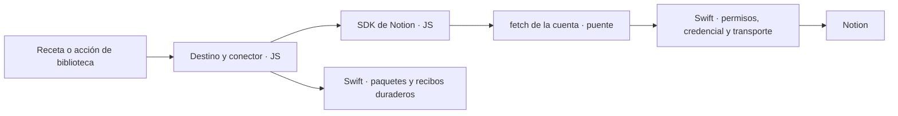
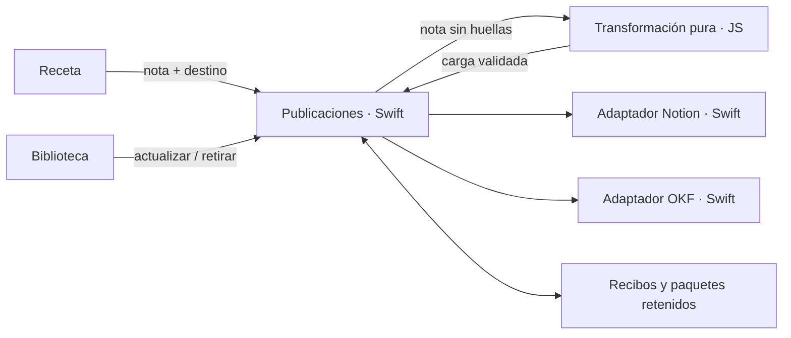

# Análisis: conectores como librerías de JavaScript

Estado: **análisis para decisión de Rubén**, 2026-10-08. No modifica RF-9 ni
autoriza construir la fase 5. Se basa en el estado de la rama
`docs/encargo-conectores-js` (`4ed9957`), separado de `feat/personas`.

## Punto de partida y términos

Vocabulario propuesto para este análisis; no cambia todavía el modelo aprobado:

- **Cuenta o vínculo local:** credencial y alcance concedido en la app. OKF
  no tiene cuenta remota ni necesita token: su vínculo es una carpeta raíz.
- **Destino:** ubicación y reglas de representación declaradas para publicar.
  Tiene una clave estable; cambiar el nombre visible no cambia su identidad.
- **Publicación:** relación duradera entre una nota y un destino. Conserva el
  localizador remoto o los documentos escritos, la versión aplicada y el
  contexto necesario para actualizarla y retirarla.
- **Entrada:** datos que acepta un destino, validados con Zod. **Carga:** su
  representación para el adaptador del proveedor. Son contratos distintos.

Hoy `Connector` reúne cuenta, destino y mapeo. Separarlos afecta a la
persistencia y al ciclo de vida, además de cambiar la interfaz de usuario.

RF-9 mantiene el conector en Swift y da a la receta la decisión de **cuándo,
dónde y con qué carga** publicar (`requisito-recetas.md`, RF-9). Su fase 5 aún
no está hecha (`roadmap.md`, «Orden»). En el código, el puente de
`RecipeSession.publish` recibe una clave y entrega una `Note` al sink Swift;
`escriba-recetas.d.ts` todavía tipa `publicar(nota)`. Faltan las cargas de RF-9
y el export `publicar` para acciones manuales. La app ya compila recetas con
esbuild en WebAssembly a un fichero para JavaScriptCore, conserva el último
paquete válido y usa Zod para `buildRecipeForm`.

Dos correcciones al encargo: el token actual se guarda por identificador del
conector en un fichero `0600`; el Llavero es solo el origen de una migración en
la primera lectura (`NotionAccount.swift`). Y **descartar una nota hoy no la
despublica**: `LibraryModel.discard` cambia el estado local. RF-9 sí propone
despublicar al borrarla; falta decidir si «descartar» cuenta como ese borrado.
Nada en este análisis requiere leer un token ni consultar Notion.

## Criterios para decidir

La prioridad de producto es **máxima flexibilidad desde JS**: poder usar las
operaciones del proveedor y evolucionar el conector sin añadir cada función
a Swift ni distribuir otra versión de Escriba. Reducir la reescritura inicial
es un criterio secundario frente a ese objetivo.

Los tres caminos se comparan con las mismas obligaciones: una corrección
debe llegar a los destinos ya publicados sin repetir STT o LLM; un proyecto
roto no debe perder el rastro para retirar publicaciones; un reintento no
puede crear a ciegas otro recurso tras un resultado incierto. JS nunca
recibe secretos, autoridad para cambiar cuentas ni huellas de voz. Una
declaración de destino solicita usar una cuenta; no concede permisos.

La decisión principal es **dónde vive el módulo que publica y mantiene una
nota**. Su interfaz debe ocultar credenciales, protocolo remoto, paquetes,
recibos y recuperación a `RecipeSession` y `LibraryModel`. Mover archivos de
Swift a TypeScript sin concentrar esas responsabilidades repartiría la misma
complejidad entre ambos llamadores.

Las transformaciones son computación pura. SQLite, la carpeta y JSC son
dependencias locales sustituibles en pruebas. Notion es una dependencia
externa y sigue detrás de un puerto con transporte falso para pruebas. Los
puertos internos no tienen que convertirse en capacidades de cada receta.

## Los tres caminos

| Camino | Swift | JavaScript del proyecto | Principal coste y riesgo |
| --- | --- | --- | --- |
| **A. RF-9 aprobado** | Cuenta y destino configurados en la app; protocolo Notion/OKF, conversión, paginación, 429, regeneración, retirada y rastro | La receta compone la carga y exporta `publicar` para acciones manuales | Menor cambio de arquitectura. Para corregir hay que conservar qué receta publicó, su paquete y sus parámetros. Un proveedor nuevo exige Swift. |
| **B. Idea completa** | Cuenta, permisos, transporte, escritura física, runtime y rastro duradero | Librerías implementan todo el conector: declaración, transformación, protocolo, paginación, política de reintento, regeneración y retirada | Mayor extensibilidad del protocolo. El paquete de conector es necesario también para retirar. El alcance del transporte requiere una política explícita. |
| **C. Intermedio** | Cuenta y alcance, protocolo Notion/OKF, paginación, 429, escritura confinada, regeneración, retirada y rastro | Cada destino declara Zod y una transformación pura de la nota vigente a una carga, ejecutable sin receta | Personalización declarativa y ciclo independiente de la receta. Hay que añadir paquetes de destino y coordinar sus versiones con las recetas. Un proveedor nuevo sigue exigiendo Swift. |

**Recomiendo B: conector y SDK del proveedor en JS, sobre un host Swift de
capacidades comunes.** Una biblioteca Notion debe poder consultar, crear,
actualizar y retirar usando el contrato del proveedor, no limitarse a producir
una carga que otro conector Swift sabe interpretar. Swift conserva el secreto,
el transporte autorizado, el almacenamiento y la ejecución duradera; la
semántica de Notion vive en la biblioteca JS.

C añade destinos declarativos y una transformación ejecutable sin receta.
Frente a lo actual mejora la autoría y el ciclo manual, pero el repertorio de
operaciones sigue fijado por el adaptador Swift. En ese aspecto conserva el
límite de RF-9 y no alcanza la flexibilidad pedida. A queda como alternativa
de menor cambio; C como compromiso si se decide reducir alcance, no como
arquitectura objetivo.

La publicación sigue siendo un módulo profundo con publicar, actualizar y
retirar. El host conserva los paquetes y recibos; el paquete JS ejecuta esas
acciones. Así el ciclo duradero no obliga a mantener el conocimiento del
proveedor en Swift. Las aproximadamente 1.327 líneas actuales de Notion y 756
de OKF sirven para inventariar paridad, no para justificar la arquitectura por
el código ya escrito.

B reabre RF-9 y concreta la regla de núcleo funcional: transformaciones y
decisiones de protocolo en funciones JS comprobables; permisos, estado y
recuperación del host en funciones puras Swift. El uso del SDK oficial también
requiere resolver la excepción a «solo Zod» y su compatibilidad con JSC antes
de implementarlo. La aprobación de esta arquitectura y sus fases sigue
correspondiendo a Rubén.

## Arquitectura recomendada B: conector y SDK en JS

En B, la transformación, los bloques Notion, el Markdown OKF y la secuencia de
operaciones pertenecen a librerías TS. Para que también funcionen fuera de una
receta, esbuild genera **paquetes de destino independientes y autocontenidos**
que incorporan esas librerías. Importar la librería únicamente dentro del
paquete de una receta no resuelve el ciclo manual.



### Encaje del SDK oficial

Se ha inspeccionado `@notionhq/client` **v5.25.2**, sin ejecutarlo. Su cliente
admite `auth` opcional y `fetch` inyectado; `request()` permite peticiones
además de los métodos tipados. Del código se deduce que se puede omitir
`auth` y añadir la credencial en el transporte Swift. [Fuente oficial de
Client.ts](https://github.com/makenotion/notion-sdk-js/blob/v5.25.2/src/Client.ts).

Esquema de uso propuesto; `fetchDeCuenta` sería el adaptador de compatibilidad:

```ts
import { Client } from "@notionhq/client"

const notion = new Client({
  fetch: fetchDeCuenta(contexto.cuenta),
  retry: false
})

const pagina = await notion.pages.create(carga)
await contexto.checkpoint({ pagina: pagina.id })
```

Swift recibe una petición HTTP autorizada y conserva su rastro; no interpreta
`pages.create` ni define las columnas o bloques disponibles. La librería puede
usar operaciones nuevas del SDK o `request()` dentro de la concesión de la
cuenta. El SDK tampoco define qué recursos pertenecen a una publicación de
Escriba: esa responsabilidad y la reconciliación quedan en la biblioteca.

**Compatibilidad JSC pendiente:** la ruta JSON requiere URL y una respuesta
con `status`, `ok`, `headers` y `text()`; las subidas usan FormData/Blob.
[Cliente inspeccionado](https://github.com/makenotion/notion-sdk-js/blob/v5.25.2/src/Client.ts).
Cada petición usa `setTimeout`/`clearTimeout`, incluso con `retry:false`.
[Implementación del timeout](https://github.com/makenotion/notion-sdk-js/blob/v5.25.2/src/errors.ts).
El paquete declara Node >=18 y no declara dependencias de producción;
eso no demuestra que funcione en JSC.
[package.json de la versión](https://github.com/makenotion/notion-sdk-js/blob/v5.25.2/package.json).

Por tanto, la primera prueba debe empaquetar ese SDK y darle un adaptador de
las utilidades necesarias, con transporte falso. Los temporizadores se
ofrecen solo en el contexto operativo del conector, con cancelación y límites;
la evaluación declarativa sigue sin capacidades. La comprobación debe cubrir
multipart antes de dar por conseguida la paridad de audio. No es necesario
exponer Node, disco general ni red global para ofrecer esas utilidades.

Se propone desactivar el retry automático del SDK y decidirlo en la librería
JS con el recibo de la operación. Así las creaciones inciertas no se repiten
por dos capas distintas. Swift aplica límites comunes, sin añadir otra política
de reintento del protocolo.

### Contrato del conector y capacidades del host

El runtime del destino ofrece `aplicar(nota, anterior, contexto)` y
`retirar(anterior, contexto)`, además de validación con permisos de lectura.
La declaración y proyección pura pueden tener la misma forma que en C; la
diferencia es que la carga la ejecuta JS. El recibo específico del conector
lleva versión y esquema propios, sin código ejecutable. Swift lo conserva y
solo la ejecución autorizada puede actualizarlo.

La librería no recibe `fetch`, una URL libre ni un token. Swift crea una
capacidad ligada al vínculo, destino, paquete y operación al ejecutar su
contexto; no entrega `escriba.cuenta(...)` a cualquier receta. Contrato
ilustrativo de esas capacidades:

```ts
type JSONValor = null | boolean | number | string
  | readonly JSONValor[] | { readonly [clave: string]: JSONValor }

interface PeticionLimitada {
  paso: string // Clave estable para el registro de esta operación.
  metodo: "GET" | "POST" | "PATCH" | "DELETE"
  ruta: string // Relativa al origen fijo de la cuenta; sin URL absoluta.
  consulta?: Readonly<Record<string, string>>
  cabeceras?: Readonly<Record<string, string>> // Solo las permitidas por el host.
  cuerpo?: string // El SDK serializa su cuerpo; Swift no interpreta Notion.
}
interface RespuestaLimitada {
  readonly estado: number
  readonly cabeceras: Readonly<Record<string, string>> // Subconjunto permitido.
  readonly cuerpo: string // Acotado; el adaptador ofrece text() al SDK.
}
interface CuentaHTTPCapaz {
  pedir(peticion: PeticionLimitada): Promise<RespuestaLimitada>
  enviarAdjunto(peticion: {
    paso: string
    ruta: string
    audio: { readonly clave: string } // Referencia ligada a la nota, no ruta.
    formato: "binario" | "multipart"
    campos?: Readonly<Record<string, string>>
    porcion?: { inicio: number; bytes: number }
  }): Promise<RespuestaLimitada>
}
interface CarpetaOKFCapaz {
  leer(): Promise<{
    revision: string
    archivos: Readonly<Record<string, string>>
  }>
  aplicar(cambios: {
    revisionEsperada: string
    escrituras: readonly { rutaRelativa: string; contenido: string }[]
    borrados: readonly string[]
  }): Promise<void>
}
interface ContextoDeConector {
  readonly operacion: string
  readonly audio: { readonly clave: string } | null
  readonly cuenta: CuentaHTTPCapaz | CarpetaOKFCapaz
  esperar(ms: number): Promise<void> // Acotado, cancelable y contabilizado.
  checkpoint(recibo: JSONValor): Promise<void>
}
```

El boceto muestra el caso JSON. La paridad con la subida de audio existente
añade `enviarAdjunto({ paso, ruta, audio, formato, campos })`: `audio` es una
referencia opaca concedida solo para la nota en curso, `formato` es binario o
multipart y `campos` son las partes de texto. Reutiliza las restricciones de
`pedir`, con método POST fijado por el host. Swift valida la referencia y el
rango, lee el archivo y codifica/transmite el cuerpo; JS decide la secuencia
del protocolo sin obtener una ruta del Mac ni capacidad para leer cualquier
archivo. Esta ampliación está incluida en
la fase de capacidades de B.

`fetchDeCuenta` adapta la forma de `fetch` a esta capacidad: comprueba que la
URL del SDK corresponde al origen concedido, transmite el cuerpo y reconstruye
la respuesta permitida. Swift vuelve a verificar todo al ejecutar; el adapter
JS no es la autoridad. Los errores del proveedor se entregan acotados para que
el SDK los interprete, sin que Swift necesite conocer cada tipo de respuesta.

`checkpoint` escribe solo el recibo de la operación en curso; JS no elige otra
nota, cuenta o publicación ni escribe configuración. El host valida formato,
tamaño y vínculo antes de persistir; la biblioteca interpreta los recursos.
Los efectos confirmados se guardan por
operación, paso y huella de petición antes de entregar su resultado al JS;
repetir el mismo paso puede recuperarlo. Los intentos transitorios, como un
429, se registran sin tratarlos como éxito reutilizable; un reintento admitido
crea otro intento del mismo paso. Reutilizar un paso con otra petición es un
conflicto. Esto no elimina la ventana de resultado incierto.

| Aspecto | Garantía que debe imponer Swift |
| --- | --- |
| Destino de red | Origen HTTPS exacto y puerto fijados en la cuenta; rutas normalizadas y métodos concedidos. El host no enumera cada endpoint Notion. Sin destinos arbitrarios, redirecciones ni cookies compartidas. |
| Autenticación | Lee el secreto solo en el host y añade la cabecera al enviar. JS no puede proporcionar Authorization, Host ni cabeceras de proxy. Cabeceras de protocolo sin secreto, como la versión de API, pueden proceder del SDK bajo una lista permitida. |
| Respuesta | Estado, cuerpo acotado y cabeceras seleccionadas como Content-Type o Retry-After. Sin cabeceras completas, objetos del transporte, volcado de petición autenticada ni mensajes de error que incluyan secretos. |
| Presupuesto | Tamaño por petición/respuesta y acumulado, llamadas, páginas, intentos y concurrencia. Timeout por petición y cancelación. El límite actual de CPU por tramo no frena un bucle infinito de `await`. |
| Revocación | Comprobar permisos actuales en cada efecto, también con paquetes históricos; un paquete nunca amplía los permisos del vínculo. |
| OKF | Solo el bundle dentro de la raíz vinculada, sin rutas absolutas, `..` ni escapes por symlinks, incluyendo cambios entre comprobar y abrir. Validar revisión y archivos gestionados antes de reemplazar/borrar. |

En B, **JS decide paginación y reintentos semánticos**, porque conoce el
protocolo. Swift impone presupuestos y cuotas compartidas de cuenta y ofrece
esperas cancelables. `Retry-After` puede exponerse como número validado; nunca
autoriza reintentos ilimitados. Swift no repite automáticamente una creación
`POST`. En A y C, tanto paginación como política de reintento permanecen en el
adaptador Swift.

Dominio y método **no restringen una base concreta**. La política propuesta
para B confía en el código del proyecto dentro del alcance concedido a la
cuenta; Notion aplica los permisos de esa integración. La ubicación declarada
sirve a la biblioteca para publicar, no se presenta como una barrera frente a
la propia biblioteca. Escriba protege el secreto y los recursos del host.

Añadir en Swift una lista de operaciones semánticas Notion volvería a limitar
qué puede hacer el SDK. Si se exige aislamiento fuerte por base incluso ante
código malicioso, habrá que aceptar ese coste o conceder cuentas de menor
alcance. Un manifiesto JS nunca amplía la concesión del host. Además, POST
puede ser lectura: un permiso «solo lectura» necesita entender operaciones;
no debe prometerse como una consecuencia de filtrar verbos.

La garantía de secreto consiste en que el puente nunca introduce el token
en la VM, y depende de perfiles de autenticación con orígenes de confianza
fijados por el host. No es válida con servidores arbitrarios que puedan
reflejar la credencial en una respuesta. Ocultar el token tampoco impide usar
su autoridad. El código del proyecto se considera confiado para publicar en
el alcance concedido; JSC dentro del proceso no se presenta como aislamiento
frente a código hostil. Son los límites explícitos de la confianza concedida
a bibliotecas que pueden usar toda la API accesible a esa cuenta.

## Alternativa C: declaración JS con protocolo Swift

La app conserva cuenta, secreto y alcance. El proyecto declara una referencia
lógica como `notion-trabajo`; la persona la vincula a una cuenta local en la
app. Así compartir el proyecto no obliga a copiar UUID de cuentas ni secretos.
Un alias nuevo queda sin vincular; nunca adquiere permiso por coincidir con
el nombre de una cuenta. Una cuenta puede servir a varios destinos.

El destino declara ubicación, esquema de entrada y transformación. El módulo
Swift de publicaciones recibe una referencia a la nota guardada, obtiene la
versión correcta, ejecuta esa transformación pura en JSC y valida la carga
antes de pasarla al adaptador. La receta solo recibe la capacidad de publicar;
actualizar y retirar son operaciones de la biblioteca.



Contrato ilustrativo para C; los nombres nuevos y tipos no están implementados.
La aplicación importa la librería local que define los destinos; el puente
del runtime sigue hablando con Standard Schema como en las recetas actuales.

```ts
import type { z } from "zod"

type JSONValor = null | boolean | number | string
  | readonly JSONValor[] | { readonly [clave: string]: JSONValor }

interface NotaPublicable {
  readonly clave: string
  readonly version: number
  readonly nombre: string
  readonly fecha: string
  readonly zonaHoraria: string
  readonly duracionSegundos: number | null
  readonly texto: string
  readonly hablantes: readonly string[]
  readonly segmentos: readonly Segmento[]
  readonly resumen: Resumen | null
  readonly datos: Readonly<Record<string, JSONValor>> | null
}

type TextoDeCarga = string | { readonly plantilla: string }

type CargaNativa =
  | { tipo: "notion"; titulo: TextoDeCarga;
      propiedades: Readonly<Record<string, JSONValor | TextoDeCarga>>;
      cuerpo: TextoDeCarga }
  | { tipo: "okf"; documentos: readonly {
      clave: string; ruta: TextoDeCarga;
      frontmatter: Readonly<Record<string, JSONValor | TextoDeCarga>>;
      cuerpo: TextoDeCarga
    }[] }

interface DefinicionDestino<E> {
  readonly clave: string
  readonly nombre: string
  readonly vinculo: string
  readonly ubicacion:
    | { tipo: "notion"; baseId: string }
    | { tipo: "okf"; prefijoRelativo: string }
  readonly entrada: z.ZodType<E>
  leer(nota: NotaPublicable): unknown
  mapear(entrada: E): CargaNativa
}

interface PublicacionRef {
  readonly clave: string // Identidad del host, no un ID remoto editable.
}
interface Publicador {
  publicar(nota: Nota): Promise<PublicacionRef>
}

// Capacidad para recetas; la revisión del catálogo la fija el host.
interface EscribaConDestinos {
  destino(clave: string): Publicador
}
// Interfaz interna de la app; no se entrega a una receta.
interface Publicaciones {
  actualizar(nota: { clave: string; version: number }): Promise<void>
  retirar(publicacion: PublicacionRef): Promise<void>
}
```

Ejemplo de declaración en el proyecto, usando un builder local `notion` que
tipa y valida la definición:

```ts
import { z } from "zod"
import { notion } from "../lib/conectores/notion"

export const actas = notion({
  clave: "actas",
  nombre: "Actas",
  vinculo: "notion-trabajo",
  ubicacion: { tipo: "notion", baseId: "base-de-actas" },
  entrada: z.object({
    titulo: z.string(), texto: z.string(),
    resumen: z.string().nullable(), proyecto: z.string()
  }),
  leer: (nota: NotaPublicable) => ({
    titulo: nota.resumen?.titulo ?? "Nota de voz",
    texto: nota.texto,
    resumen: nota.resumen?.texto ?? null,
    proyecto: nota.datos?.proyecto
  }),
  mapear: entrada => ({
    tipo: "notion",
    titulo: entrada.titulo,
    propiedades: { Proyecto: entrada.proyecto, Resumen: entrada.resumen },
    cuerpo: entrada.texto
  })
})

export function buildDestinations() { return [actas] }

// En flujo(): las inferencias se conservan como datos de la nota.
nota.datos = { ...nota.datos, proyecto: "Investigación" }
await nota.guardar()
await escriba.destino("actas").publicar(nota)
```

La secuencia es `leer(nota vigente)` → validación Zod → `mapear(entrada)` →
validación nativa → efecto. `leer` y `mapear` no reciben capacidades, reloj ni
azar; solo JSON e identificadores cruzan el runtime. Swift construye
`NotaPublicable` mediante una lista explícita de campos, sin serializar las
huellas de Personas. Una referencia de nota inventada por JS no permite leer
otra grabación: el host la coteja con la sesión.

**Guardar una carga JSON no basta para republicar**. Si contenía la
transcripción antigua, seguirá antigua
al corregir hablantes. La relación ejecutable con la nota vive en `leer`.
Las inferencias ya calculadas permanecen en `nota.datos`; no se vuelve a
preguntar a un LLM. Como extensión se podrían aceptar parámetros por
publicación, congelados junto al recibo; no se prometería recalcular los
valores que la receta hubiera derivado fuera del destino. Recomiendo dejar
esa extensión fuera de la primera versión.

La carga nativa expresa valores, no peticiones HTTP ni bloques serializados.
Swift convierte columnas y cuerpo, conserva el vaciado explícito con `null`
o listas vacías y mantiene los IDs lógicos de documentos OKF. Omitir una
propiedad no equivale a vaciarla. Para migrar, `{ plantilla: "..." }` conserva
el intérprete actual de `NoteValues`, incluyendo fechas, duración, fuente y
audio; un string ordinario es literal. Es un valor reservado del contrato,
validado como tal. Los `{{enlace:id}}` se resuelven en Swift después de
asignar las rutas finales por ID de documento, incluidas las colisiones. Así
no hay que adivinar en JS qué nombre de archivo acabará disponible.
Si un destino necesita publicar audio, se añade una referencia opaca al audio
de esa nota: Swift lo lee y sube; JS no recibe rutas ni bytes biométricos.

### Declaración, visualización y validación

El catálogo tiene una entrada propia, `destinos/destinos.ts`, que exporta
`buildDestinations()`. La evaluación inicial no tiene red ni escritura. De
cada esquema se obtiene `~standard.jsonSchema.input()` para mostrar campos,
obligatoriedad, descripciones y restricciones. El esquema Zod ejecutable
permanece en el paquete; el JSON Schema no sustituye refinaciones o validación.
La UI reutiliza las piezas de `RecipeForm` que representen ese subconjunto,
en modo lectura, y señala los esquemas no soportados con la ruta del campo.

La base Notion y el prefijo/rutas OKF viven en código. La app muestra nombre,
vínculo, ubicación, datos aceptados y revisión instalada; solo edita la cuenta
o carpeta vinculada. OKF no necesita configurar N documentos en la app, pero
sí elegir una raíz autorizada o aceptar una carpeta por defecto explícita.

Hay tres validaciones distintas: compilación y esquema sin red; comprobación
del destino con los metadatos de la cuenta; permisos y carga al ejecutar. Una
caída de Notion deja el destino «sin comprobar» o «no disponible», no invalida
su código ni descarta el último paquete bueno. La declaración de una base no
amplía los permisos de la integración. En C, Swift comprueba recursos y tipos
antes de actuar; en OKF controla raíz, rutas, duplicados y recursos gestionados.

## Publicar fuera de una receta y rastro

Hoy corrección de hablantes, cambio o eliminación del resumen y elección de
versión pasan por `LibraryModel.republish`, que usa sinks Swift; «Publicar»
manual también usa un sink. El cambio para cada alternativa es diferente:

| Acción | A: RF-9 | C: transformación pura | B: conector completo |
| --- | --- | --- | --- |
| Publicación inicial | La receta entrega la carga a Swift. | La receta entrega nota y destino; el paquete del destino prepara la carga y Swift la aplica. | La receta entrega nota y destino; el paquete del destino ejecuta el protocolo con capacidades. |
| Corrección, resumen o cambio de versión | Runner nuevo invoca el export `publicar` de la receta autora, con capacidades de publicación únicamente. | Runner nuevo invoca `leer`/Zod/`mapear` del destino con la nota vigente; Swift regenera. | Runner del destino invoca `aplicar` con nota vigente y recibo previo. |
| Retirar | Swift usa recibo y cuenta. | Swift usa recibo y cuenta; no necesita JS. | JS ejecuta `retirar` con recibo y capacidades de esa cuenta. |

En A, la receta autora debe guardarse **por publicación**. Si A llama a B con
`procesar` y B publica, conservar solo la receta raíz no sirve. El runner
manual no ofrece STT, LLM, `guardar` ni redirecciones y se limita a los destinos
ya publicados: corregir un hablante no empieza a publicar en otros destinos
añadidos después. Si falta el export `publicar`, se avisa como dice RF-9.
Estos detalles son necesarios para concretar RF-9 y no están implementados.

En B/C, la receta queda como procedencia, y el paquete de destino conserva la
transformación. La actualización toma la nota vigente y sus datos guardados;
no necesita que exista la receta original ni vuelve a ejecutar su `flujo`.
Para la publicación manual inicial se selecciona un destino compatible con
esa nota y se valida su entrada. Un campo requerido ausente falla con su ruta.

### Qué se conserva y quién es su dueño

El rastro pertenece al módulo Swift, nunca a un fichero editable de la
librería. Como mínimo necesita identidad de nota y destino, vínculo local,
ubicación efectiva, versión deseada y aplicada de la nota, huella del paquete,
versión de contrato, procedencia, carga/intención en curso y recibo con todos
los recursos gestionados. En A añade paquete y parámetros efectivos de la
receta autora; en B/C añade paquete del destino. La clave de destino debe
estar cualificada por proyecto para que cambiar la carpeta vinculada no
mezcle publicaciones con claves iguales.

Los paquetes referenciados se archivan por huella en almacenamiento de la
app, fuera del proyecto. Se retienen mientras alguna publicación u operación
los necesite. RF-18 solo conserva un último paquete bueno por receta presente;
borrar la receta puede eliminar su entrada instalada. Ni esa caché ni la
huella en la traza sustituyen este archivo duradero.

**Política recomendada, pendiente de Rubén:** las correcciones usan el paquete
y configuración que creó la publicación. Los cambios de código sirven para
publicaciones nuevas; adoptar una revisión nueva para las anteriores es una
acción explícita que valida esquema, cuenta, ubicación y recibo. Así una
corrección de texto no cambia también la base o el formato por sorpresa.
Retener código no conserva indefinidamente una versión de Notion: habrá que
migrar publicaciones si cambia el contrato del proveedor o del host.

| Situación | Comportamiento propuesto |
| --- | --- |
| El proyecto no compila o su carpeta desaparece | Usar el paquete retenido de la publicación, sin compilar. Las publicaciones nuevas siguen RF-18 con su último paquete bueno compatible. |
| Se borra el destino del código | No admitir publicaciones nuevas; conservar recibos y código para mantener las existentes. |
| Falta el paquete retenido o el contrato ya no es compatible | Actualizar queda bloqueado a la vista. A/C todavía pueden retirar con Swift; B necesita restaurar o migrar el paquete. |
| Se revoca la cuenta o el acceso a la carpeta | Bloquear nuevos efectos, incluso desde paquetes antiguos. Conservar el recibo para reintentar cuando se recupere acceso. |
| Se cambia base, carpeta o cuenta | No reinterpretar el recibo antiguo. Un traslado se trata como nueva publicación y retirada explícita de la anterior. |
| Se decide borrar también lo remoto al eliminar una nota | Mantener el mínimo rastro de retirada hasta terminar; no borrar primero los únicos IDs/rutas. Descartar hoy no hace esto. |

La retirada del catálogo se aplica al activar una **declaración completa y
válida** que ya no contenga la clave. El host marca ese destino como retirado
para nuevas publicaciones, y esa regla prevalece sobre parejas antiguas que
todavía lo referencien. Se siguen permitiendo actualización y retirada de
vínculos existentes con sus recibos. Un error de compilación o de lectura de
la carpeta no equivale a retirar destinos: conserva la activación anterior.
Reintroducir una clave no modifica las ubicaciones guardadas en sus recibos.

### Fallos y concurrencia

El orden es fijar nota/paquete → validar → persistir intención → aplicar
efectos y registrar recursos confirmados → guardar versión aplicada. Solo
entonces se comunica éxito. Serializar por publicación evita que una
corrección nueva quede sobrescrita por una petición antigua que acaba tarde;
para OKF también hay que coordinar los índices y el log compartidos de carpeta.
Si llega otra versión durante la escritura, permanece como actualización
pendiente.

No hay transacción distribuida entre Notion y SQLite, entre dos destinos ni
entre todos los archivos de un bundle OKF. Distinguir `pendiente`,
`sincronizada`, `parcial`, `incierta` y `retirada`, además del motivo del error,
permite decidir qué reintentar. Los dos códigos públicos actuales de error
pueden conservarse, pero el host necesita ese estado duradero. Si Notion
termina y OKF falla, el éxito de Notion no se deshace ni se repite a ciegas.

El código actual **no garantiza exactamente una vez**: Notion guarda el ID
después de añadir los bloques; una caída intermedia puede dejar una página
sin rastro. La búsqueda por clave depende de que haya columna configurada,
y no reintentar `POST` en el transporte no elimina una respuesta perdida.
Hay que guardar el localizador en cuanto llegue y reconciliar operaciones
inciertas; si no puede demostrarse el resultado, no crear otra página
automáticamente. También hoy un fallo al persistir el journal puede quedarse
solo en el log. Corregirlo es trabajo compartido por A/B/C.

OKF debe conservar las N rutas y su identidad/versión gestionada. Los cambios
se validan antes de aplicarlos, con bloqueo, escritura por archivo y un plan
recuperable; no se promete atomicidad visible del bundle entero. Un archivo
ajeno o modificado fuera de Escriba requiere una política de conflicto, nunca
un borrado inferido solo de las plantillas actuales.

## Distribución y versiones

Las librerías del proyecto y el SDK oficial tienen funciones distintas. Las
primeras contienen sus destinos y comportamiento; el SDK es una dependencia
externa versionada. El resolvedor actual solo admite imports relativos y Zod,
así que introducir `@notionhq/client` **requiere una excepción explícita**;
copiar su código como fichero local no elimina esa decisión.

| Vía | Ventaja | Coste y condición |
| --- | --- | --- |
| Copia de la plantilla en `lib/conectores/` | Compatible con la regla actual; editable y reproducible con el repo del usuario. | Las mejoras no llegan solas. Actualización explícita con diff y versión/origen registrados; no sobrescribir cambios propios. |
| Librería administrada por la app como Zod | Arreglos centralizados, sin pedir un gestor de paquetes al usuario. | Nuevo resolvedor/caché con versión y huella; conservar versiones referenciadas. La activación no puede modificar paquetes anteriores. |
| Paquete npm propio | Distribución y herramientas externas conocidas. | Reabre «solo Zod», requiere aprobación de Rubén y una estrategia de resolución/lockfile; no implica aceptar cualquier npm ni scripts de instalación. |

Para B recomiendo **bibliotecas de destino locales y SDK administrado como
dependencia permitida**, con versión y huella fijadas por proyecto. La app
descarga y verifica el artefacto y sus tipos, esbuild lo incluye en el paquete
autocontenido y el motor solo ejecuta ese paquete. No se abre la resolución a
cualquier npm ni se ejecutan scripts de instalación. Actualizar el SDK es una
acción explícita que recompila y valida una nueva revisión, conservando las
anteriores. El primer spike determinará el artefacto y las utilidades JSC que
hay que suministrar; no se ha instalado ninguna dependencia en este encargo.

En C se podría empezar con fuentes copiadas por plantilla, porque el
protocolo permanece en la app. El paquete opcional `@zetesis/escriba-recipes`
de RF-4 no está implementado ni sustituye al SDK del proveedor.

Hay tres revisiones: contrato del host, paquete de destino y paquete de
receta. La receta instalada referencia una revisión compatible del catálogo.
La instalación debe activar esa pareja de forma atómica; una receta que
falle al compilar conserva **su pareja anterior completa**. No puede usar su
último JS bueno contra un catálogo global recién cambiado. Las publicaciones
conservan después la revisión que usaron, aunque se active otra pareja para
nuevas ejecuciones.

El paquete de destino incluye librería, configuración, esquema y
transformación. Guardar solo JSON Schema perdería código de validación y
proyección. El manifiesto serializable permite mostrarlo sin capacidades y
el archivo por huella permite ejecutarlo sin fuentes. El motor recibe
paquetes; esbuild sigue siendo responsabilidad de la app. Esto respeta los
puertos del núcleo portable, pero no proporciona un runtime JS en Linux o
WASI: hoy el adaptador JSC es de macOS. No se reabre el proyecto de plugins
WebAssembly descartado.

RF-18 escribe la plantilla una vez y después solo permite escrituras
automáticas en `.escriba/`. La instalación o actualización de fuentes y del
`.d.ts` en un proyecto existente debe ser una acción explícita. Los paquetes
duraderos pertenecen al almacenamiento de la app; `.escriba/` sirve para
diagnósticos y tipos, no como única copia para poder retirar publicaciones.

## Migración sin perder publicaciones

1. En la implementación futura, inventariar la configuración y el rastro;
   no mover ni leer secretos durante la conversión. Mantener el UUID de cada
   conector como identificador de cuenta inicial y enlazarlo al alias generado
   del proyecto: el fichero de token conserva su asociación. No deduplicar
   cuentas comparando secretos. Se puede agruparlas después de forma explícita.
2. Generar un destino por conector existente con clave estable derivada de
   su UUID y generar la transformación pura desde la configuración vigente:
   base, columna a plantilla y cuerpo Notion; carpeta y **N documentos OKF**
   con IDs, frontmatter, cuerpos y referencias `{{enlace:id}}`. No sobrescribir
   código del proyecto; dar vista previa, copia de seguridad y resolver
   colisiones de nombres antes de escribir. En A, esa conversión genera el
   export `publicar` de RF-9; en C, `leer`/`mapear`; en B, además se instala
   la librería del proveedor. Preservar nombre, activación y referencias de
   las recetas al conector antiguo mediante una tabla explícita de equivalencia.
3. Conservar el intérprete de plantillas legado o demostrar equivalencia de
   la traducción a JS con casos de prueba, incluidos campos ausentes y
   resúmenes vacíos. Comparar las cargas resultantes sobre notas sintéticas
   antes de activar el destino nuevo. Mantener el conector viejo disponible
   hasta pasar la verificación, pero un único camino activo por publicación;
   ejecutar ambos duplicaría efectos. Registrar el avance de migración para
   poder continuar tras un cierre.
4. Migrar el rastro a identidad `(nota, destino)` sin cambiar los IDs remotos.
   Para OKF, reconstruir o registrar **todas** las rutas publicadas antes de
   retirar ficheros; la fila actual conserva solo una. Una ubicación que
   cambie después no autoriza borrar o sobrescribir otra: se actúa sobre el
   recibo anterior y se pide una decisión de traslado. Si hay dudas sobre la
   propiedad de un fichero, no inferir su borrado. Volver a la implementación
   anterior después de publicar conserva los recibos nuevos: no se restaura
   una copia obsoleta de la base que olvidaría efectos ya realizados.
5. Hacer una publicación y regeneración de prueba con datos ficticios y una
   base de prueba cuando Rubén autorice la fase 5; solo entonces retirar los
   editores antiguos. Este análisis no toca Notion ni publica nada.

Una persona puede tener solo recetas de formulario y ningún proyecto. C y B
deben ofrecer la creación del proyecto para personalizar destinos o mantener
un paquete de compatibilidad administrado por la app para sus conectores
heredados. Recomiendo esa compatibilidad durante la migración; exigir código
a todos los usuarios sería otra decisión de producto. La promesa «destinos
solo lectura» no explica por sí sola cómo configura su primera base alguien
sin proyecto, y el alcance OSS exige resolver ese recorrido antes de retirar
el editor.

## Coste, fases y criterios de salida

Estimación de ingeniería, **no medida**, en jornadas de una persona que
conoce el repo. Incluye los dos conectores actuales, migración, pruebas locales
y revisión; excluye OAuth, gestor general de npm, aislamiento en otro proceso,
nuevos proveedores y esperas de autorización. Las horquillas se solapan porque
el trabajo principal está en el ciclo de publicación, compartido por los tres
caminos. No corresponde asignar toda la recuperación ante fallos solo a B.

| Trabajo | A | C | B | Criterio de salida |
| --- | ---: | ---: | ---: | --- |
| Contrato y ejecución de la carga | 2–4 | 3–5 | 7–12 | A: cargas nativas; C: Zod/proyección pura; B: capacidades y librerías con paridad, incluido audio. |
| Rastro y recuperación | 3–5 | 3–5 | 4–7 | Efectos parciales y resultado incierto visibles; localizador temprano; revocación y concurrencia probadas. |
| Paquetes y ciclo manual | 3–5 | 4–6 | 4–6 | Actualizar/retirar con fuentes borradas o rotas; autor correcto en A; parejas receta/catálogo compatibles en B/C. |
| Migración y vista de cuentas/destinos | 3–5 | 3–6 | 3–6 | Mapeos, N documentos, referencias y vínculos preservados; activación única y vuelta atrás con recibos actuales. |
| Integración y documentación | 2–3 | 2–3 | 2–4 | Matriz de aceptación local completa y recorrido de usuario revisable. |
| **Total** | **13–22** | **15–25** | **20–35** | Jornadas; no fecha de entrega prometida. |

Orden recomendado para B: primero SDK empaquetado en JSC con transporte falso
y credencial ficticia inyectada por Swift; después un destino con publicación,
actualización y retirada usando paquete retenido; después migración y vista
de solo lectura. El SDK puede ahorrar cliente HTTP y tipos del proveedor;
no sustituye las reglas de Escriba para regenerar páginas, producir N documentos
o recuperar un efecto incierto. Antes de retirar editores
se mantiene la comprobación real de RF-9, con datos sintéticos y autorización
futura; esa comprobación no se ha hecho en esta investigación.

La aceptación debe ejercitar la interfaz del módulo: corregir texto y quitar
resumen manteniendo enlace, actualizar con el proyecto roto, retirar un
destino borrado, revocar cuenta con paquete antiguo, fallar después de crear
una página, guardar recibo fallido, interrumpir N documentos OKF y enfrentar
dos versiones concurrentes. También una receta antigua frente a un catálogo
nuevo incompatible, rutas fuera de raíz y ausencia de secretos/huellas en el
puente. Usar swift-testing, nombres en español, JSC real y SQLite/carpeta
temporales; Notion se sustituye por transporte controlado o servidor local.

No se ha realizado un spike. El puente asíncrono ya existe, pero el diseño de
`pedir`, su confinamiento y el nuevo ciclo **no están validados por eso**. Si
se elige B, una prueba local de 1–2 jornadas, incluida en su primera fase,
debe comprobar inyección de una credencial ficticia, rechazo de redirecciones,
presupuestos y recuperación después de un efecto confirmado. La mayor
incertidumbre restante está en la migración y reconciliación remota.

No se introduce servidor propio ni una cuota de infraestructura por elegir
JS. Sí hay coste de mantenimiento: A/C actualizan protocolos con la app; B
actualiza librerías y su compatibilidad con permisos/recibos. Guardar paquetes
históricos ocupa disco y obliga a una política de retención. El coste de CPU
y memoria de los paquetes de destino no se ha medido; no se promete una
mejora de rendimiento por cambiar de lenguaje.

## Decisiones pendientes de Rubén

1. El objetivo de flexibilidad ya está aclarado: B. Queda aprobar la excepción
   concreta a «solo Zod» para empaquetar el SDK oficial con versión fijada y
   validar primero su ejecución en JSC.
2. ¿Las correcciones conservan la revisión que publicó, con actualización
   explícita a otra, o siguen siempre la última revisión buena? Recomiendo
   fijar revisión para que una corrección no cambie de ubicación o formato.
3. ¿«Descartar» solo afecta a la biblioteca o también retira lo publicado?
   El análisis no cambia el comportamiento local actual.
4. Para quien no tiene proyecto, ¿se mantiene un recorrido de serie y
   compatibilidad administrada, o personalizar/vincular el primer destino
   exige crear un proyecto? Recomiendo preservar el caso sin código.
5. Para B se propone confiar en la librería dentro del alcance de la cuenta.
   Si se exige además aislamiento fuerte por destino, hay que concretarlo
   antes de construir el transporte: cambia la arquitectura y puede volver a
   introducir conocimiento del proveedor en Swift.

## Evidencia local y límites del análisis

Lectura de código, revisión de tres diseños y consulta de fuente pública del
SDK oficial. No se ejecutó la app, un spike ni llamadas a la API de Notion.
Las propuestas de contrato, estados y costes necesitan
validación durante su implementación. El único entregable es este documento.

| Evidencia | Fuentes |
| --- | --- |
| RF-9 aprobado y fase 5 pendiente | [Requisito de recetas](requisito-recetas.md), RF-9 y RF-18; [roadmap](roadmap.md). |
| Publicación JS actual pasa clave al sink | [Prelude.swift](../Sources/EscribaJSC/Prelude.swift), [RecipeSession.swift](../Sources/EscribaEngine/RecipeSession.swift), [contrato TS](../recetas/escriba-recetas.d.ts). |
| Acciones manuales actuales y descarte local | [LibraryModel.swift](../Sources/EscribaModel/LibraryModel.swift), `publish`, `republish`, `unpublish`, `discard`. |
| Token en archivo y migración desde Llavero | [NotionAccount.swift](../Sources/EscribaModel/NotionAccount.swift), `defaultTokenStore`; solo se leyó el código. |
| Último paquete bueno sin archivo histórico | [RecipeProject.swift](../Sources/EscribaEngine/RecipeProject.swift), `rebuildRecipeProject`; [RecipeShelf.swift](../Sources/EscribaEngine/RecipeShelf.swift). |
| Rastro actual y fallos de persistencia del journal | [Rows.swift](../Sources/EscribaStore/Rows.swift), `PublicationRow`; [AppRuntime.swift](../Sources/EscribaMenuBar/AppRuntime.swift), `journal` y `okfJournal`. |
| Notion: creación, regeneración, paginación y reintentos | [NotionPublish.swift](../Sources/EscribaNotion/NotionPublish.swift), [NotionClient.swift](../Sources/EscribaNotion/NotionClient.swift). |
| OKF: N documentos, planificación y aplicación | [OKFBundle.swift](../Sources/EscribaOKF/OKFBundle.swift), [OKFSink.swift](../Sources/EscribaOKF/OKFSink.swift). |
| Imports y esquema declarativo existentes | [EsbuildScripts.swift](../Sources/EscribaJSC/EsbuildScripts.swift), [ZodPackage.swift](../Sources/EscribaJSC/ZodPackage.swift), [RecipeFormSchema.swift](../Sources/EscribaJSC/RecipeFormSchema.swift). |
