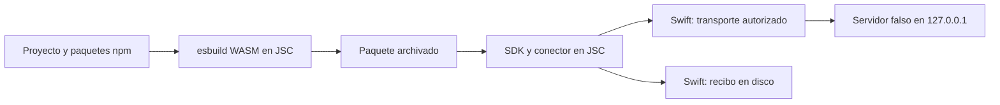

# POC desechable: conectores npm en JavaScriptCore

## Resultado

**Viable para las operaciones ejercitadas.** El SDK real de Notion y Zod,
instalados desde npm, se compilan con esbuild **WebAssembly dentro de
JavaScriptCore** y se ejecutan en otro JavaScriptCore. El conector JS crea,
regenera, retira y adjunta audio. Swift aporta transporte, credencial ficticia,
temporizadores y un journal local; no interpreta endpoints de Notion.

Ejecución del 2026-10-08: **67 comprobaciones correctas y 25 peticiones al
servidor falso**. Paquete: **907.499 bytes**; compilación JS: **7,218 s**;
recorrido completo: **37,760 s**, incluida la compilación de los ejecutables
nativos de prueba. Es una medida puntual de este Mac, no un benchmark de la app.
El [resultado completo](resultado.json) conserva las comprobaciones, las
peticiones sintéticas y las huellas de las fuentes ejecutadas.

Esto valida una base técnica para sustituir el conector Swift por librerías
JS. La sustitución completa exige integrar y endurecer el diseño. La app no
ha sido modificada y no se ha publicado ni llamado a Notion.



## Ejecutar

Requiere macOS con JavaScriptCore y las herramientas de Swift, Python 3 y Node
solo para instalar dependencias. Desde este directorio, una vez:

```sh
npm ci --ignore-scripts --no-audit --no-fund
```

Después, todo el recorrido se ejecuta con:

```sh
python3 run.py
```

También puede ejecutarse `python3 /ruta/al/repo/spikes/conector-js/run.py`
desde otro directorio. La prueba compila únicamente sus dos hosts nativos,
no la app, y usa un puerto efímero enlazado a `127.0.0.1`. Un sandbox que
prohíba abrir puertos locales requiere permiso para ese comando.

No se ejecuta Node al compilar o publicar. Las versiones están fijadas en el
lockfile: `@notionhq/client` 5.25.2, `esbuild-wasm` 0.28.2 y `zod` 4.6.5.
La instalación también se reconstruyó con `npm ci --offline` desde la caché
después de la primera descarga.

Cada ejecución guarda sus artefactos en `.scratch/PROTOTYPE-*`; `latest.txt`
indica la última. La eliminación de fuentes durante la prueba afecta solo
a la copia desechable creada allí. No se lee el Llavero, Application Support,
audio del usuario ni ninguna configuración de cuentas.

## Qué comprueba

| Caso | Evidencia |
| --- | --- |
| Paquetes npm | SDK y Zod reales; fixture versionada con subruta `zod/v4`, dependencia anidada, exports condicionales y JSON. `node:fs` produce error. |
| Declaración | JSON Schema de Zod obtenido sin ninguna petición HTTP. No se prueba aquí la vista SwiftUI. |
| Publicación | SDK crea página y bloques; Swift escribe el recibo antes de confirmar el checkpoint. |
| Actualización independiente | La fuente deja de compilar; se conserva el paquete. Se borran fuentes y node_modules de la copia. Otro proceso actualiza la misma página, pagina los bloques, elimina los anteriores y añade los nuevos. |
| Audio | SDK crea y envía multipart con un WAV sintético PCM16 mono: 80 muestras de silencio a 8 kHz. El servidor comprueba los 204 bytes y la referencia del bloque audio. |
| Retirada | Otro proceso archiva la misma página usando el paquete y el recibo retenidos. |
| Credencial y permisos | Swift autentica todas las peticiones; no aparece la credencial en el paquete ni en las respuestas entregadas a JS. Origen ajeno, cabecera Authorization aportada por JS y redirección se rechazan. Revocar la cuenta evita HTTP con un paquete antiguo. |
| Fallo parcial | Error al añadir bloques después de crear; el recibo conserva el localizador y permite completar sobre la misma página. |
| Cierre del proceso | Salida inmediata con código 86 después del checkpoint; otro proceso lee el journal y completa la página sin duplicarla. No simula pérdida de alimentación del equipo. |
| 429 | Se propaga el error y solo se hace una petición. La política de espera/reintento de producción no está implementada. |
| Respuesta perdida | El servidor crea la página y corta la conexión. El SDK no repite el POST. Queda una creación incierta sin recibo: reconciliarla es trabajo pendiente. |

Los paquetes `@fixture/*` son datos de prueba versionados, copiados al árbol
desechable mediante `compiler/fixtures/install-manifest.json`; no son paquetes
publicados. El SDK también ejercita código CommonJS. `resultado.json` contiene
las huellas del compilador, host, destino, orquestador y lockfile ejecutados.

## Qué falta antes de sustituir el sistema actual

1. **Integración y migración:** contratos reales del motor, rastro SQLite,
   activación atómica receta/destino, migración de configuraciones y páginas
   existentes. La prueba usa un journal JSON y un destino de ejemplo.
2. **Paridad del producto:** mapeos y regeneración completos de Notion,
   reconciliación tras respuesta perdida, concurrencia, límites y reintentos;
   tampoco se ha trasladado ni probado el conector OKF.
3. **Compatibilidad:** el resolvedor y las funciones URL, Blob, FormData y
   demás utilidades son parciales. No demuestran compatibilidad con cualquier
   npm ni con todo Node. Faltan resolución completa y rechazo fiable de imports
   dinámicos que dependan de módulos en ejecución.
4. **SDK completo:** su entrada CommonJS referencia un fallback de `crypto`
   para webhooks. El compilador lo sustituye explícitamente por un módulo que
   falla al usarse y lo registra en metadatos. Firmar/verificar webhooks y
   OAuth están fuera de esta prueba; no se ha eliminado funcionalidad de
   publicación para hacer pasar los escenarios.
5. **Host de producción:** políticas por capacidad, límites antes de agotar
   memoria, cancelación y aislamiento revisados. Se filtran cabeceras y se
   redacta un eco literal del secreto ficticio; eso no demuestra resistencia
   frente a un servidor malicioso que lo codifique de otra manera.
6. **Servicio real:** el servidor falso valida el recorrido y los bytes. No
   certifica que Notion acepte todas las cargas, permisos y estados remotos.
   Esa comprobación sigue fuera del encargo y necesita autorización futura.

## Archivos

- [run.py](run.py): servidor falso, escenarios y aserciones observables.
- [project/destino.ts](project/destino.ts): declaración y conector con SDK real.
- [compiler](compiler/README.md): esbuild WASM/JSC y resolvedor del proyecto.
- [runtime](runtime/README.md): host Swift/JSC, compatibilidad y transporte.
- [Análisis de arquitectura](../../docs/requisito-conectores-js.md).

Todo el código de esta carpeta es desechable. No debe copiarse a producción
como implementación ya endurecida.
